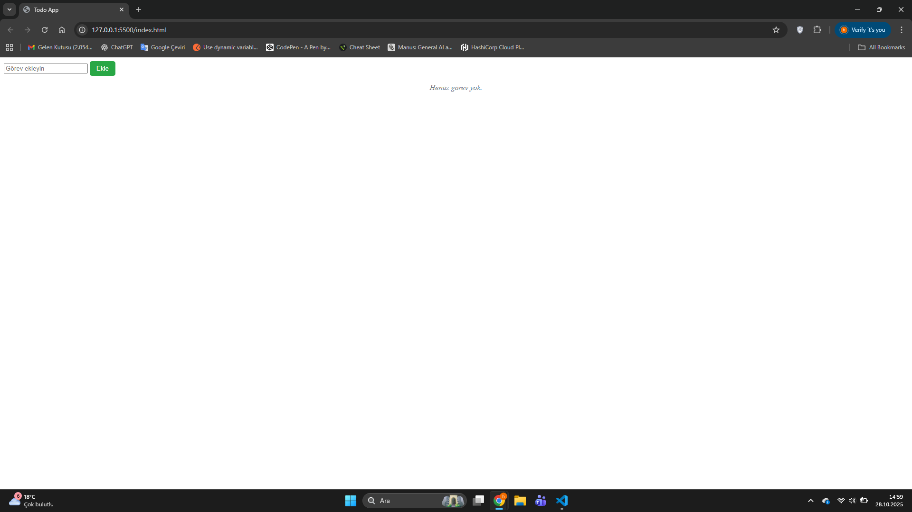
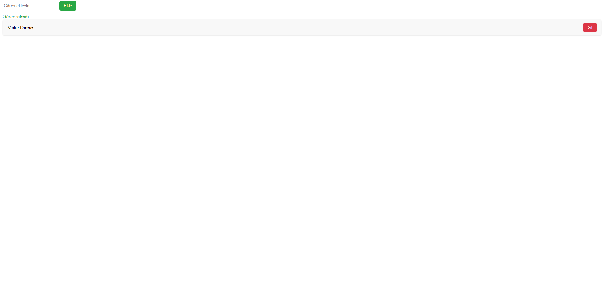

# Modern To-Do (Vanilla JS)

Modüler JavaScript mimarisiyle yazılmış küçük ama profesyonel To-Do uygulaması.

## 🚀 Özellikler
- ➕ Görev ekleme, 🗑️ silme
- 💾 localStorage ile kalıcı veri
- ⚠️ DOM tabanlı hata/mesaj sistemi (fade animasyonlu)
- 🧹 Clean Code, tek sorumluluk, event delegation
- 📦 Frameworksüz (saf JS) → React mantığına hazır

## 🖼️ Ekran Görüntüleri

### 📍 Boş liste görünümü


### 🧾 Görev silindikten sonra


## ⚙️ Kurulum & Çalıştırma
```bash
git clone https://github.com/harun-trkylmzgl/modern-todo-js.git
cd modern-todo-js
# Statik proje; index.html'i tarayıcıda açman yeterli.
# İstersen VS Code Live Server ile 127.0.0.1:5500 üzerinden çalıştır.
```

## 📂 Dosya Yapısı
```
/js
  ├─ main.js      # Event kontrol katmanı (UI → Logic)
  ├─ helper.js    # İş mantığı (add/remove/updateState/render/showAlert)
  └─ data.js      # Başlangıç verisi + storage okuma
```

## 🧠 Teknik Notlar
- `updateState()` tek merkezden: storage senkron + render + mesaj
- `showAlert()` tek fonksiyon (success/error, 2.0 sn fade-out)
- Event delegation: `.js-output` kapsayıcı tıklamalarını dinler,
  `.js-remove-button` hedefini yakalayıp `data-index` ile siler.

## 🧾 Lisans
MIT © 2025 Harun Türkyılmazoğlu
